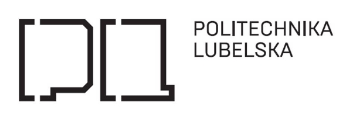

Programowanie Full-Stack w Chmurze 

Obliczeniowej  

**Sprawozdanie 2** 

Prowadzący Sebastian Słupny   Sławomir Przyłucki 

**1. (max. 100%)** 

Wykorzystując opracowaną aplikację (kod + Dockerfile) z zadania nr1 należy: 

a. zbudować, uruchomić i potwierdzić poprawność działania łańcucha Github Actions, 

który zbuduje obrazy kontenera z tą aplikacją na architektury: linux/arm64/v8 oraz linux/amd64 wykorzystując QEMU 

Aby wykonać zadanie opracowałem plik konfiguracyjny build.yaml, który opisuje wszystkie kroki do wykonania. 

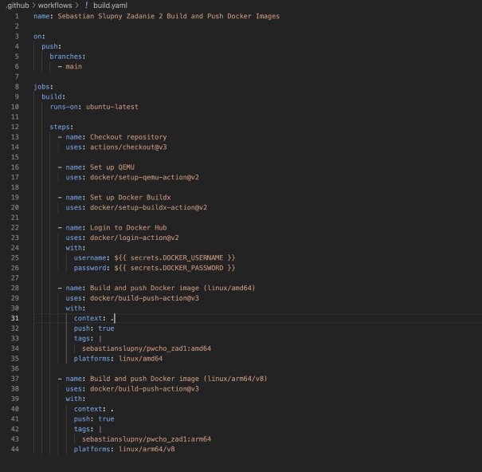

Do logowania wykorzystano zmienne tajne 

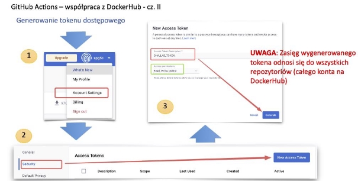

Zrzut instrukcji prowadzącego zajęcia 

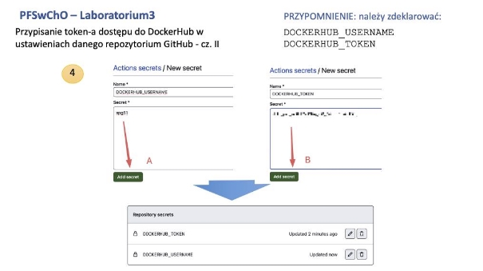

Zrzut instrukcji prowadzącego zajęcia Po skonfigurowaniu wszystkiego wykonano commit i push do repozytorium.  

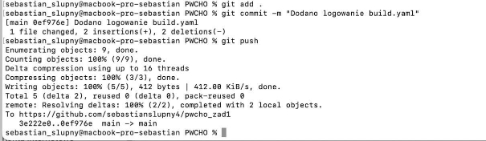

Zrzut ekranu z terminala 

Wrzuciłem do repozytorium, następnie łańcuch został uruchomiony automatycznie. Stan możemy sprawidzić w repo github w zakładce Actions. 

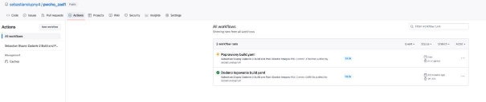

Zrzut Actions w tracie budowania  

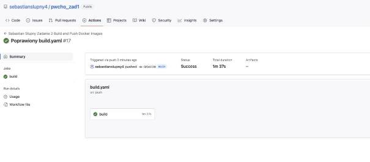

Zrzut Actions po  zbudowaniu 

Aby sprawdzić wykonanie możemy zobaczyć stan workflow  

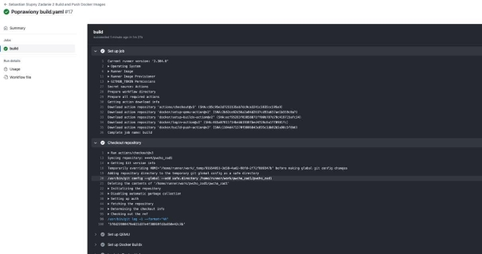

Zrzut stanu build.yaml 

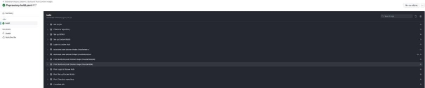

stanu build.yaml 

Jak możemy zobaczyć Actions nie wykazał problemów przy wykonaniu zadania  

Po przejściu na hub.docker.com widzimy ze nasze obrazy są poprawne 

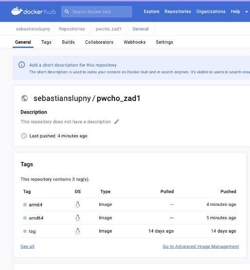

**Podsumowanie:**

Przeprowadziłem proces budowy i publikacji obrazów kontenera za pomocą łańcucha Github Actions. Wykorzystałem plik konfiguracyjny build.yaml, który opisuje wszystkie kroki do wykonania. 

Najpierw skonfigurowałem zdarzenie, które wyzwala łańcuch. W moim przypadku zdarzenie to push do gałęzi main. Gdy wprowadziłem zmiany i wrzuciłem je do repozytorium, łańcuch został uruchomiony automatycznie. 

W kolejnych krokach skonfigurowałem środowisko. Użyłem akcji actions/checkout@v3, aby pobrać kod aplikacji. Następnie skonfigurowałem QEMU i Docker Buildx za pomocą akcji docker/setup-qemu-action@v2 i docker/setup-buildx-action@v2, aby umożliwić budowę obrazów dla różnych architektur. 

Aby móc publikować obrazy, zalogowałem się do Docker Hub przy użyciu akcji docker/login- action@v2. Podając swoje dane uwierzytelniające jako zmienne tajne, byłem w stanie zalogować się bezpiecznie. 

Następnie przyszedł czas na budowanie i publikację obrazów. Użyłem akcji docker/build- push-action@v3, aby skonfigurować proces budowania i publikacji dla architektury linux/amd64. Wskazałem również odpowiednie tagi i platformy, aby obraz został odpowiednio oznaczony i dostępny dla tej architektury. 

Analogicznie, użyłem tej samej akcji docker/build-push-action@v3, aby zbudować i opublikować obraz dla architektury linux/arm64/v8. Podobnie jak wcześniej, określiłem tagi i platformy, aby obraz był dostępny dla tej konkretnego architektury. 

Po zakończeniu wszystkich kroków, łańcuch Github Actions został wykonany. Sprawdziłem logi, aby upewnić się, że wszystkie kroki zostały wykonane poprawnie, a obrazy Docker zostały zbudowane i opublikowane dla obu architektur. 

**Teraz mogę potwierdzić, że łańcuch Github Actions został pomyślnie wykonany** i obrazy kontenera dla architektur linux/arm64/v8 i linux/amd64 zostały zbudowane i opublikowane. Moja aplikacja jest teraz dostępna i gotowa do użycia na różnych platformach. 

Opracowany plik serwer.py 

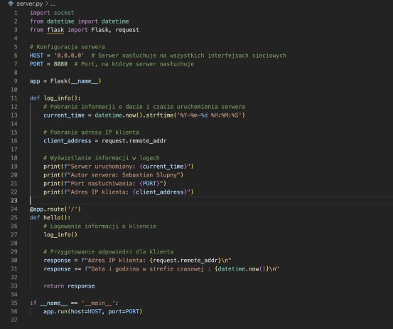

Kod server.py 

Opracowany plik Dockerfile… 

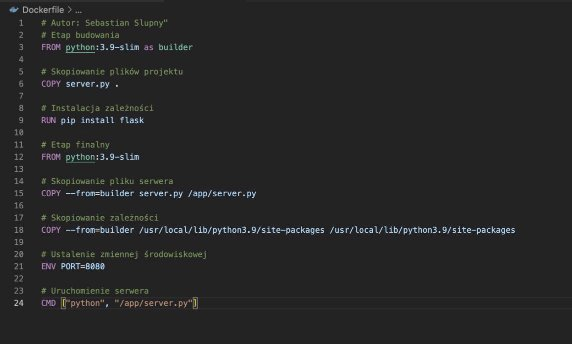

Plik Dockerfile 

**Repozytorium GitHub:** https://github.com/sebastianslupny4/pwcho\_zad1/ **Repozytorium DockerHub:** https://hub.docker.com/r/sebastianslupny/pwcho\_zad1 
